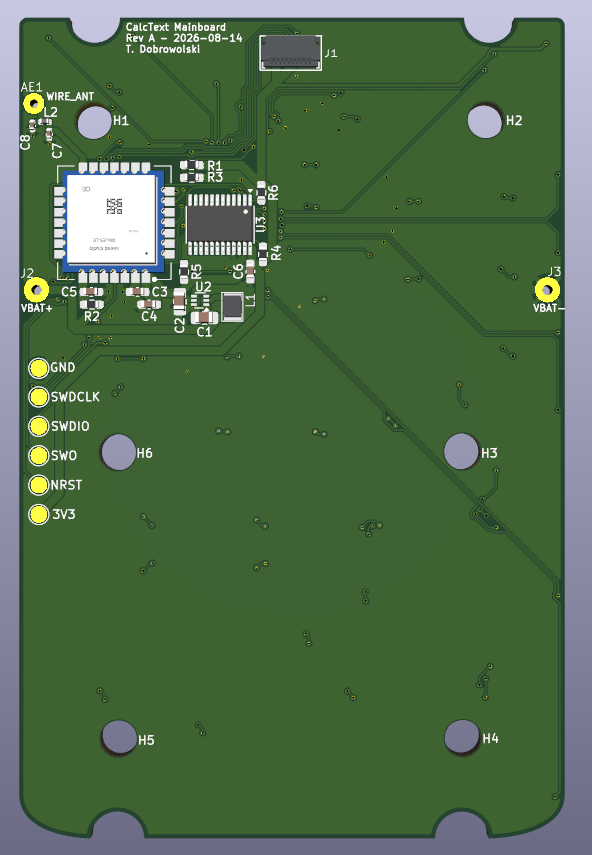
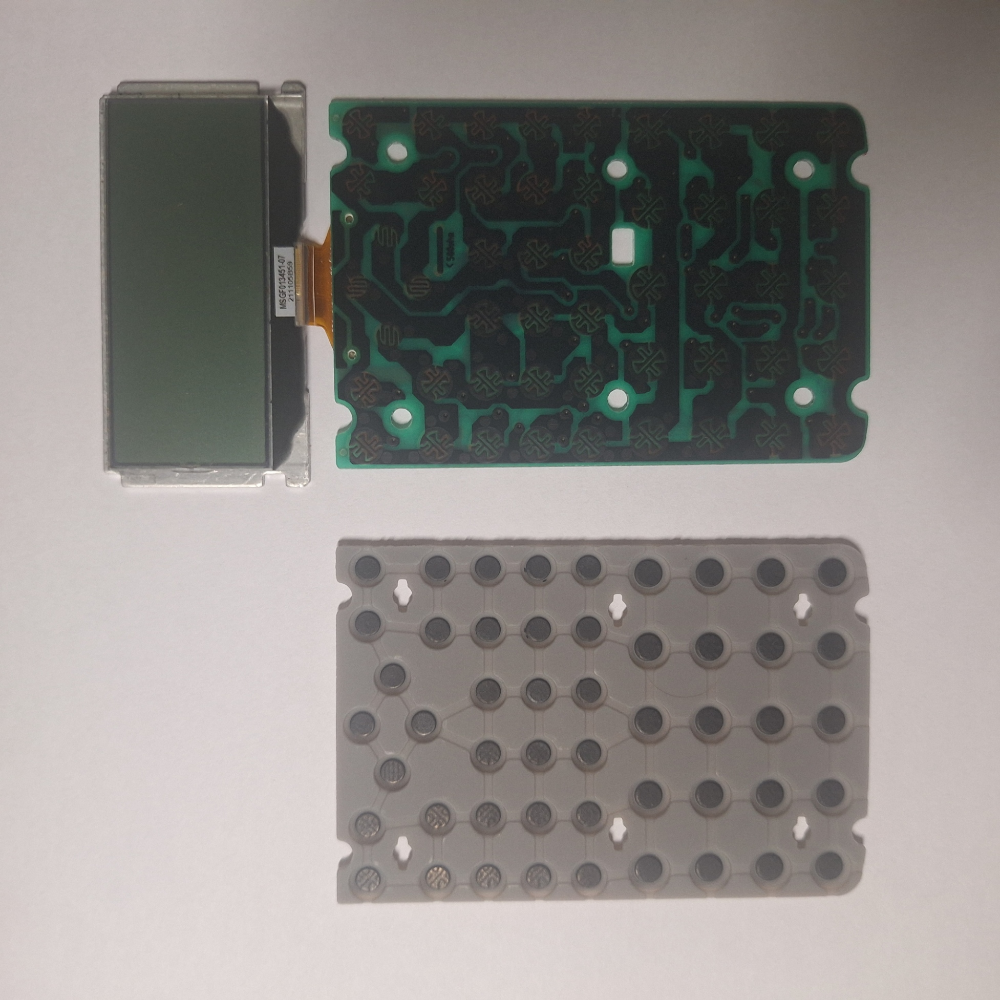
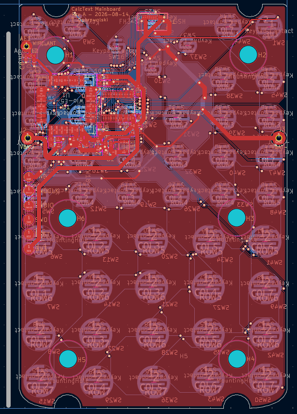
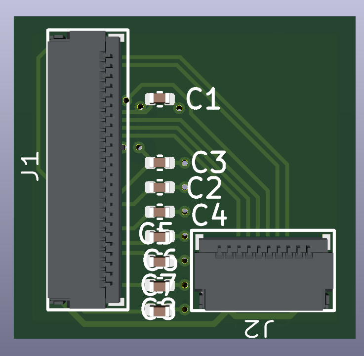
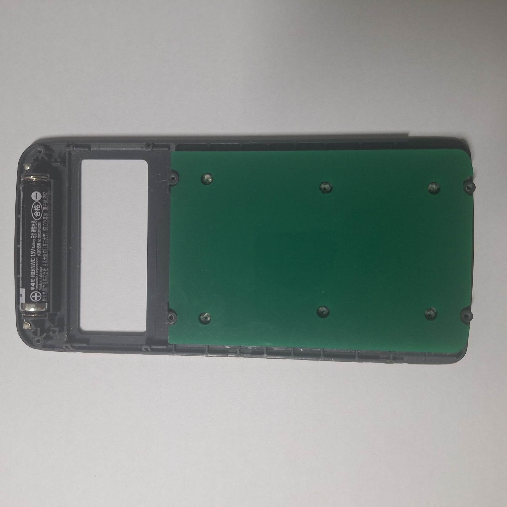

# CalcText

## What is CalcText?

CalcText is a wireless messaging device enclosed inside a scientific calculator, powered by a single AAA battery. Two units can message each other directly over LoRa, not requiring Wi-Fi, mobile data, or any kind of external infrastructure. The idea came to me from wanting to message a friend who sat far away from me in my maths class without using my phone or shouting. Despite being a little odd, the idea stuck with me.

*CalcText Rev A mainboard 3D render.*

## How it works

CalcText replaces all of the internal calculator electronics, including the PCB and LCD screen, whilst making use of some of the existing mechanical features.

CalcText makes use of several electronic components.

| Part | Purpose |
| --- | --- |
| Wio-E5-LE | MCU and LoRa radio module |
| TPS61299 | Boosts AAA voltage to 3.3 V |
| PCAL9535A | GPIO expander, scans original keypad matrix for input |
| HLCD290TB reflective display | Replacement display for calculator |
| Interposer board | Connects display to mainboard |
| ~90 mm wire antenna | Used for 868 MHz LoRa |

*Original calculator keypad and PCB assembly.*

CalcText makes use of an existing elastomeric keypad that was part of the original calculator. It gives the user a way to interact with the contacts on the PCB. The old contact pattern is therefore replicated on the replacement PCB.

*Rev A mainboard PCB layout.*

A direct FPC connection isn't viable from the reflective display to the mainboard, so an intermediary interposer board is used, to be located on the rear of the display.

*LCD interposer 3D render.*

## Fitting it inside the calculator

The main challenge is getting everything to fit inside the original enclosure.

| Part to fit | Issue | Resolution |
| --- | --- | --- |
| Mainboard | There are mounting holes, thickness, and outline constraints | Produced acrylic fit test using school equipment and measured original PCB thickness with calipers |
| Display | Larger footprint and thinner than original | Sections of the enclosure can be removed, and PORON foam can secure it |
| Interposer | Unknown FPC landing position due to bend once display is installed | Order screen first and design interposer size based on measured landing position |
| Antenna | Needs sufficient distance from metal and components to ensure good transmission quality | Keep antenna routed down long edge through visible gap, allow it to exit the PCB as far from the display and battery as possible |

*Acrylic mainboard fit test inside the calculator enclosure + Location of battery.*

## Current status

| Element | Status |
| --- | --- |
| Mainboard schematic | Complete |
| Mainboard layout | Complete |
| Interposer schematic | Complete |
| Interposer layout | Pending display measurements |
| BOM | Complete |
| Physical build | Pending components |
| Funding | Pending review |

## Next steps

1. Submit project for review
2. Order all currently finalised parts
3. Take necessary measurements
4. Complete and order interposer
5. Fully assemble 2 CalcTexts
6. Write firmware
7. Test messaging
8. Tune antenna if necessary
9. Project complete

## BOM

The full BOM can be found in [`bom.csv`](bom.csv).
This BOM covers *two* individual CalcText units.

## Credits

This project was enabled by [Hack Club, Macondo](https://macondo.hackclub.com).

You can access the project's full development journal [here](https://macondo.hackclub.com/projects/16515).
